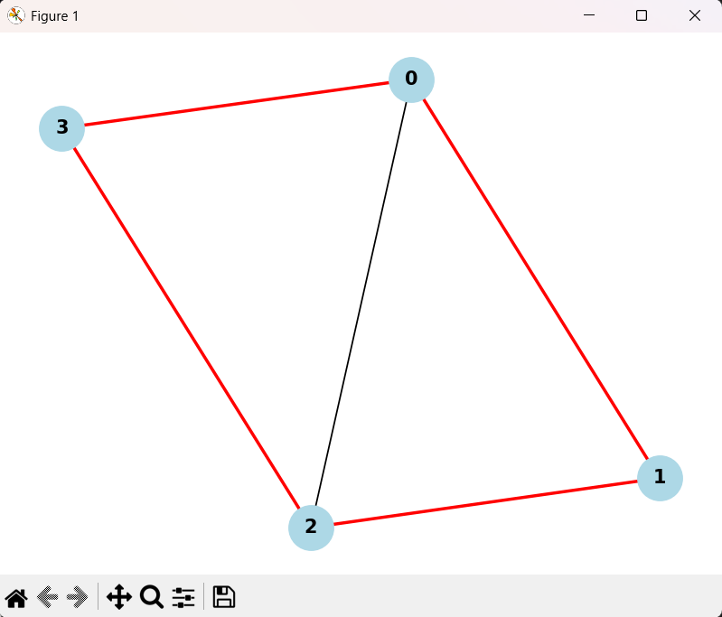

# Caminho Hamiltoniano – Relatório Técnico


## Descrição do Projeto

Este projeto consiste na implementação de um algoritmo para determinar a existência de um **Caminho Hamiltoniano** em um grafo não orientado. O algoritmo verifica se existe um caminho que **visita todos os vértices do grafo exatamente uma vez**, utilizando a técnica de **backtracking** para explorar todas as possibilidades de caminhos válidos. O trabalho faz parte da disciplina de Fundamentos de Projeto e Análise de Algoritmos.

## Como Executar o Projeto

### Requisitos

- Python 3.x instalado
- (Opcional) NetworkX e Matplotlib para visualização

### Execução

1. Clone o repositório:
   ```sh
   git clone https://github.com/RenatoMAP77/Caminho-Hamiltoniano.git
   ```
2. Acesse o diretório do projeto:
   ```sh
   cd Caminho-Hamiltoniano
   ```
3. Execute o script principal:
   ```sh
   python main.py
   ```
4. (Opcional) Para visualizar o grafo e o caminho Hamiltoniano:
   ```sh
   pip install networkx matplotlib
   python view.py
   ```

## Lógica do Algoritmo

O algoritmo implementado utiliza **backtracking** para tentar construir um caminho que passe por todos os vértices do grafo, sem repetições. A lógica é a seguinte:

1. Inicia-se com o vértice 0.
2. Para cada posição no caminho, tenta-se adicionar um vértice ainda não visitado que seja adjacente ao último.
3. Se todos os vértices forem inseridos com sucesso, e houver uma aresta ligando o último ao primeiro (fechando um ciclo), então existe um Caminho Hamiltoniano.
4. Caso contrário, o algoritmo retorna para tentar outras possibilidades (backtracking).

## Explicação do Código

### `main.py`

```python
def is_valid(v, pos, path, graph):
```
Verifica se o vértice `v` pode ser adicionado na posição `pos`:
- Deve existir uma aresta entre `path[pos-1]` e `v`.
- `v` ainda não pode estar no caminho.

```python
def hamiltonian_util(graph, path, pos):
```
Função recursiva que tenta construir o caminho Hamiltoniano a partir da posição atual.

```python
def find_hamiltonian_path(graph):
```
Função principal que inicia o caminho com o vértice 0 e chama a função recursiva.

### `view.py`

Utiliza NetworkX e Matplotlib para desenhar o grafo, destacando as arestas do caminho Hamiltoniano em vermelho, caso ele seja encontrado.

## Análise da Complexidade Assintótica

### O que é complexidade assintótica?

É a forma de medir como o tempo de execução de um algoritmo cresce em relação ao tamanho da entrada. Utiliza-se a notação Big-O para indicar o crescimento no **pior caso**, além das notações **Ω(n)** e **Θ(n)** para representar o melhor caso e o caso médio, respectivamente.

### Complexidade do Algoritmo

- **Pior caso:** O algoritmo testa todas as possíveis permutações dos vértices → **O(N!)**
- **Melhor caso:** Encontra o caminho válido nos primeiros ramos → desempenho quase linear
- **Caso médio:** Depende da estrutura e densidade do grafo → exponencial

A complexidade foi determinada pela contagem do número de caminhos possíveis em um grafo com N vértices, considerando que em cada etapa se tenta inserir um novo vértice ainda não visitado.

## Análise pelo Teorema Mestre

O Teorema Mestre aplica-se a problemas que podem ser descritos por recorrências do tipo:

$$
T(n) = aT(n/b) + f(n)
$$

No entanto, neste projeto, o algoritmo não se baseia em uma divisão regular do problema. Ao invés disso, tenta várias combinações possíveis de caminhos, o que foge da estrutura necessária para aplicação direta do teorema.

### Conclusão

**O Teorema Mestre não se aplica neste caso**, pois não há uma divisão recursiva padrão do problema. A estrutura de chamadas é baseada em busca e não em subdivisões com custos balanceados.

## Classificação de Complexidade: P, NP, NP-Completo e NP-Difícil

O problema do Caminho Hamiltoniano pertence à classe **NP-Completo**:

- **Classe NP:** Verificar se uma solução é válida leva tempo polinomial.
- **Classe NP-Completo:** É um dos problemas mais difíceis da classe NP; o problema do **Caixeiro Viajante (TSP)** pode ser reduzido a ele.
- Não se conhece algoritmo de tempo polinomial para resolver todos os casos.

## Visualização

A visualização é opcional e serve como complemento gráfico para o projeto:

- Todos os vértices e arestas são desenhados.
- O Caminho Hamiltoniano é destacado em vermelho.

### Exemplo:



## Referências

- [AULA 02 – Introdução à Teoria da Complexidade](https://github.com/joaopauloaramuni/fundamentos-de-projeto-e-analise-de-algoritmos/tree/main/PDF)
- Material da disciplina Fundamentos de Projeto e Análise de Algoritmos – João Paulo Carneiro Aramuni
- [NetworkX Documentation](https://networkx.org/)
- [Matplotlib Documentation](https://matplotlib.org/)

---